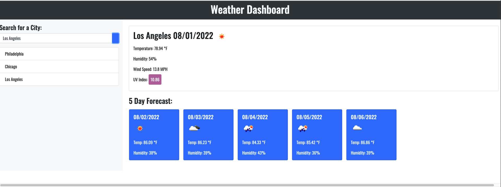

# weather-dashboard

## Mockup

## Objective 

Creating a weather app for users who are planning to travel to a city and would like to know how the weather will be there.

As a user, I would love to be able to look for a city & be able to see the predicted forecast for that city in the current day along with the 5 day forecast. 
For the sake of convenience, I would love for the city/cities I search for to be saved somewhere to click between my searches. 

## Questions 

What was your motivation? 

My motivation for this project was to practice my skills with API. This project gave me confidence to work with API and each project going forward, I feel like I get better with going through documentation to look for answers that could help me! As a beginner with API's, this was an amazing project to work on. It is a stepping stone to what you could build with API's, the options are endless. I would love to create a new project involving API's that interest me, maybe even give weather API's another shot! 

Why did you build this project? 

I built this project to understand API's a bit more, this was my first try at dealing with API's and it totally opened the door for me. I understood how to dissect the data recieved from API's a bit more and hope to get even better! 

What did you learn?

This project I learned the different API's you could be working with. Is it free for everyone, do you have to put in a email, or maybe even pay for the key? There are a ton of different API's that could leave you wondering if it has a key or not. I learned how to implement the data given from an API onto a website. Overall, great assignment to work on and was a ton of fun to complete! 

## Deployed Page

https://natesoum.github.io/weather-dashboard/